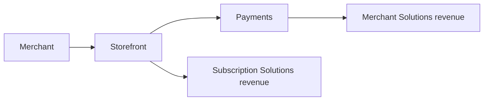

# Task 5: Report Assembly - Detailed Workflow

This document provides step-by-step instructions for executing Task 5 (Report Assembly) of the initiating-coverage skill.

## Task Overview

**Purpose**: Write and assemble the comprehensive final initial-coverage report. In this repository, the default written deliverable is run-local `report.md`; create DOCX only if explicitly requested.

**Prerequisites**: ⚠️ Verify before starting - ALL PREVIOUS TASKS REQUIRED
- **Hard prerequisites** (must exist in the run folder before assembly):
  - `<run>/model.xlsx` — the financial model (with Task 3 valuation tabs)
  - `<run>/outputs.json` — named valuation/model outputs for traceability
  - `<run>/data/normalized/model_extracts/` — extracted data tables from the model
  - `<run>/assets/charts/` — final chart files from Task 4
- **Required**: Company research from Task 1
- **Required**: Financial model from Task 2
- **Required**: Valuation analysis from Task 3
- **Required**: Chart files from Task 4

**⚠️ CRITICAL: DO NOT START THIS TASK UNLESS ALL TASKS 1-4 ARE COMPLETE**

This is the final assembly task. It cannot be completed without all previous work products.

**IF ANY OF TASKS 1, 2, 3, OR 4 ARE NOT COMPLETE**: Stop immediately and inform the user which tasks need to be completed first. The specific requirements are:
- Task 1: Company research document (6-8K words)
- Task 2: Financial model with all 6 tabs
- Task 3: Valuation analysis with price target and recommendation
- Task 4: Charts in `<run>/assets/charts/` with 25-35 final charts and chart index

Do not attempt to create placeholder content, substitute missing sections, or assemble an incomplete report. The report requires ALL inputs to be publication-ready.

**Output**: Comprehensive Equity Research Report (`report.md` by repository default; `.docx` only if explicitly requested)
- Markdown length: target 3,500-6,000+ words minimum for initial coverage
- DOCX length if requested: 30-50 pages
- Charts/images: reference curated visuals from `<run>/assets/charts/` and `<run>/assets/screenshots/`
- Tables: 8-20 comprehensive tables depending on output format

---

## 🔥 CRITICAL INSTRUCTION: SPARE NO TOKENS OR EFFORT

**THIS IS THE FINAL DELIVERABLE. GO ALL OUT. NO SHORTCUTS. NO ABBREVIATIONS.**

After completing 4 previous tasks, this final task assembles everything into publication-ready institutional research. **This must be PERFECT.**

### Absolute Requirements

**DO:**
- ✅ **Use ENTIRE token budget if needed** - This is what it's for
- ✅ **Write EVERY section in FULL** - Not summaries, not placeholders, FULL CONTENT
- ✅ **Use the chart set** - Reference every material chart from `<run>/assets/charts/` throughout the document
- ✅ **Create ALL 12-20 tables** - Extract every financial table from Excel, don't skip any
- ✅ **Use Task 1 research efficiently** - integrate Company 101 content, but keep `report.md` self-contained and focused
- ✅ **Write detailed Projection Assumptions** - product-by-product, region-by-region detail where data supports it
- ✅ **Write detailed Scenario Analysis** - specific Bull/Base/Bear parameters
- ✅ **Achieve 3,500-6,000+ words in `report.md`** - initial coverage must be detailed, not a brief note
- ✅ **If DOCX requested, produce 30-50 pages minimum** - text-dense with charts every 200-300 words
- ✅ **Professional institutional quality** - Indistinguishable from JPMorgan/Goldman Sachs

**NEVER:**
- ❌ "This section would include..." - WRITE THE ACTUAL SECTION
- ❌ "Charts would be inserted here..." - INSERT THE ACTUAL CHARTS
- ❌ "See financial model for details..." - EXTRACT AND WRITE THE DETAILS
- ❌ "For brevity, we'll summarize..." - NO SUMMARIZING, WRITE IN FULL
- ❌ Skip sections to conserve tokens - USE WHATEVER TOKENS ARE NEEDED
- ❌ Create abbreviated versions - EVERY SECTION MUST BE COMPLETE
- ❌ Reference external files instead of including content - INCLUDE EVERYTHING

### Quality Standard

**This report will be read by institutional investors making million-dollar decisions.**

It must be:
- **Complete**: Every section written in full with no placeholders
- **Comprehensive**: All data extracted and included, all charts embedded
- **Professional**: Proper formatting, source notes where useful, tables, and charts throughout
- **Thorough**: Deep analysis with specific numbers, detailed assumptions, complete scenarios
- **Dense**: frequent charts/tables near the relevant text; avoid text-only deliverables when visuals exist

**Creating the final work product of a 6-10 hour equity research process. Make it count.**

---

## Input Verification (CRITICAL)

**BEFORE STARTING - ALL TASKS MUST BE COMPLETE:**

### Task 1 Verification:
- [ ] Company research document exists? (6-8K words)
- [ ] Management bios complete? (300-400 words × 3-4 execs)
- [ ] Competitive analysis complete? (5-10 competitors)
- [ ] Risk assessment complete? (8-12 risks)

### Task 2 Verification:
- [ ] Financial model exists and can be opened?
- [ ] Model has projections (5 years)?
- [ ] Scenarios exist (Bull/Base/Bear)?
- [ ] Revenue by product table complete (20-30 rows)?
- [ ] Revenue by geography table complete (15-20 rows)?

### Task 3 Verification:
- [ ] Valuation analysis complete?
- [ ] Price target determined?
- [ ] Recommendation set? (BUY/HOLD/SELL)
- [ ] DCF analysis complete with sensitivity table?
- [ ] Comparable companies analysis complete with statistical summary?

### Task 4 Verification:
- [ ] 25-35 chart files exist?
- [ ] All 4 mandatory charts present?
  - [ ] Revenue by product (stacked area)
  - [ ] Revenue by geography (stacked bar)
  - [ ] DCF sensitivity (heatmap)
  - [ ] Valuation football field
- [ ] Chart files accessible and can be opened?
- [ ] Chart index created?

**IF ANY VERIFICATION FAILS**: Stop and complete missing task first.

---

## Report Specifications

### Length Requirements
- **Markdown default**: 3,500-6,000+ words minimum for initial coverage
- **DOCX only if requested**: 30-50 pages and 10,000-15,000 words
- **Charts/images**: use curated PNG/JPG assets from `<run>/assets/`
- **Tables**: 8-20 comprehensive financial / valuation / peer / scenario tables
- **Density**: concise but detailed; avoid text-only deliverables when visuals are available

### Critical Sections with Depth Guidelines

For `report.md`, be concise but substantive; for DOCX, expand toward sell-side page depth.

| Section | Default report.md depth | Critical? |
|---------|-------------------------|-----------|
| Investment Summary | 400-700 words | |
| Investment Thesis | 600-1,000 words | |
| Risk Factors | 500-900 words | |
| Company / Business Model | 800-1,500 words | |
| **Projection Assumptions** | **1,000-2,000 words** | ⭐ YES |
| **Scenario Analysis** | **700-1,500 words** | ⭐ YES |
| Financial Analysis | 800-1,500 words | |
| Valuation Methodology | 800-1,500 words | |

**Total default target: 3,500-6,000+ words. Expand if the company complexity warrants it or if DOCX is explicitly requested.**

---

## Report Structure

### Page 1: Investment Summary (CRITICAL PAGE)

**This is the most important page. Must have:**

1. **"INITIATING COVERAGE" header** (NOT "Company Update")
2. **Thesis-focused title** (e.g., "AI Platform Leader Positioned for 40% CAGR")
3. **Rating box** with:
   - Rating (BUY/OUTPERFORM/HOLD/UNDERPERFORM/SELL)
   - Current price
   - Target price
   - 52-week range
   - Market cap
   - Enterprise value
4. **Research analyst information** with credentials
5. **Stock price performance chart** (Figure 1)
6. **3-4 detailed investment bullets** with ■ character
   - Each bullet has **bold topic header** + 3-5 sentences
   - Lead with key numbers
7. **Financial summary table** (2-3 years historical + 2-3 years projected)
   - Years noted as "A" for actual, "E" for estimate

**Bullet Format Example:**
```
■ **Vertical SaaS leadership and regulatory moat should enable $50bn+ TAM by 2030.**
Deep domain expertise in healthcare IT, strong customer retention (95%+ net revenue retention),
and cross-sell capabilities have driven Acme Health's market expansion. With the healthcare IT
market expected to reach $50bn+ by 2030, Acme Health is well-positioned to capture share given
its regulatory moat and high switching costs. Management has indicated that 70% of current
revenue comes from enterprise hospital systems, suggesting strong product-market fit.
```

### Pages 2-5: Investment Thesis & Risks

**Investment Thesis (800-1,200 words)**
- 3-5 key thesis pillars
- Each pillar: 200-300 words
- Lead with key statistic
- Quantify financial impact
- Include timeline

**Risk Assessment (600-900 words)**
- 8-12 identified risks
- Organized by category:
  - Company-specific risks (4-6)
  - Industry/market risks (3-4)
  - Financial risks (2-3)
  - Macroeconomic risks (2-3)
- Each risk: 50-100 word description

### Pages 6-17: Company 101

**Company Description (800-1,200 words)**
- What the company does (plain English)
- Business model and monetization
- Geographic presence
- Scale metrics

**Company History (800-1,200 words)**
- Founding story
- Timeline of major milestones
- Strategic pivots
- Recent developments

**Management Team (1,000-1,400 words)**
- 300-400 word bio for each of 3-4 key executives
- Include: role, background, accomplishments, education
- Governance structure

**Products & Services (700-1,000 words)**
- Detailed product portfolio
- Features and differentiation
- Target customers
- Pricing models

**Customers & Go-to-Market (500-700 words)**
- Customer segments
- Distribution channels
- Sales strategy
- Key partnerships

**Industry Overview (800-1,200 words)**
- Industry definition and scope
- Market size and growth
- Key trends
- Regulatory environment

**Competitive Landscape (700-1,000 words)**
- 5-10 key competitors
- Market positioning
- Competitive advantages
- Market share analysis

**TAM Analysis (500-700 words)**
- Total addressable market sizing
- Market growth projections
- Company's serviceable market

### Pages 18-30: Financial Analysis

**Historical Financial Analysis (1,200-1,800 words)**
- Revenue trends and drivers
- Margin evolution
- Cash flow analysis
- Key metrics trajectory
- Historical context

**Projection Assumptions (2,000-3,000 words)** ⭐ CRITICAL

**MUST be extremely detailed. Structure:**

**A. Revenue by Product Assumptions (1,000-1,500 words)**

For EACH major product category:
```
[Product Category A] Revenue Assumptions

We project [Product A] revenue to grow from $XXM in 2024A to $XXM in 2029E,
representing a XX% CAGR. This growth is driven by:

1. [Driver 1 with specific quantification]
   - Specific metric: from XX to XX
   - Timeline: achieving YY by 2026E
   - Basis: [source or rationale]

2. [Driver 2 with specific quantification]
3. [Driver 3 with specific quantification]
[... 8-12 detailed points total for this product ...]

Specific assumptions by year:
- 2025E: XX% growth driven by [specific factors]
- 2026E: XX% growth as [specific factors]
- 2027-2029E: XX% CAGR as [longer-term factors]

Key risks to these assumptions include [specific risks].
```

**Repeat for EACH major product category.**

**B. Geographic Revenue Assumptions (500-800 words)**

For EACH major region:
```
[Region] Revenue Assumptions

We project [Region] revenue to grow XX% CAGR from 2024-2029E, reaching $XXM, driven by:

1. [Market dynamic with quantification]
2. [Distribution expansion with specifics]
3. [Competitive positioning]
[... 6-8 detailed points total for this region ...]
```

**Repeat for EACH major geographic region.**

**C. Other Key Assumptions (500-700 words)**
- Gross margin evolution (with specific drivers and bridge)
- Operating expense assumptions (R&D, S&M, G&A as % of revenue)
- Working capital assumptions (DSO, DIO, DPO with specific days)
- CapEx as % of sales (with justification)
- Tax rate assumptions

**Scenario Analysis (1,500-2,000 words)** ⭐ CRITICAL

**MUST have specific parameters for each scenario. Structure:**

**Bull Case (500-700 words)**
```
Bull Case: [Title describing key optimistic scenario]

Probability: XX%

Key Assumptions:
- Revenue CAGR (2024-2029E): XX% (vs. XX% base case)
- 2029E Revenue: $X,XXXm (vs. $X,XXXm base)
- 2029E EBITDA Margin: XX% (vs. XX% base)
- Key product growth: XX% CAGR (vs. XX% base)
- Geographic expansion: [specific milestones and timeline]
- Market share: XX% by 2029E (vs. XX% base)

Catalysts Required for Bull Case:
1. [Specific catalyst] - Expected timing: [date/quarter]
2. [Specific catalyst] - Expected timing: [date/quarter]
3. [Specific catalyst] - Expected timing: [date/quarter]

Detailed Rationale:
[200-300 words explaining what needs to happen for bull case to materialize.
Be specific about product launches, market conditions, competitive dynamics, etc.]

Valuation Implications:
- DCF Value: $XX per share (XX% upside from current)
- Trading Comps: XX.Xx EV/EBITDA implies $XX per share
- Bull Case Target: $XX per share
```

**Base Case (300-500 words)**
```
Base Case: [Title describing most likely scenario]

Probability: XX%

Key Assumptions:
[Similar structure to Bull Case with base assumptions]

Rationale:
[Explain why this is most likely scenario]

Valuation:
- DCF Value: $XX per share
- Trading Comps: $XX per share
- Base Case Target: $XX per share (weighted average)
```

**Bear Case (500-700 words)**
```
Bear Case: [Title describing downside scenario]

Probability: XX%

Key Assumptions:
[Similar structure with downside parameters]

Downside Triggers:
1. [Specific risk event] - Likelihood: [%]
2. [Specific risk event] - Likelihood: [%]
3. [Specific risk event] - Likelihood: [%]

Rationale:
[200-300 words on what would cause bear case]

Valuation Implications:
- DCF Value: $XX per share (XX% downside from current)
- Trading Comps: $XX per share
- Bear Case Target: $XX per share
```

**Scenario Comparison (200-300 words)**
- Comprehensive comparison table with key metrics
- Analysis of probability-weighted outcomes
- Risk/reward assessment
- Path dependency discussion

**Growth Drivers (800-1,200 words)**
- 3-5 key growth drivers
- Each quantified with specific opportunity size
- Timeline and milestones
- Supporting data from model

### Pages 31-40: Valuation Analysis

**Valuation Methodology (800-1,200 words)**

**DCF Analysis (300-400 words)**
- Methodology explanation
- Key assumptions:
  - WACC: X.X% (calculation breakdown)
  - Terminal growth: X.X% (rationale)
  - Terminal margin: XX% (justification)
- Sensitivity analysis discussion
- DCF value: $XX per share

**Comparable Companies (300-400 words)**
- Peer selection rationale (why these 5-10 companies)
- Statistical summary (max/75th/median/25th/min)
- Multiple selection (why EV/EBITDA vs. EV/Revenue vs. P/E)
- Premium/discount justification (why target deserves premium/discount)
- Comparable companies value: $XX per share

**Precedent Transactions (200-300 words, if applicable)**
- Transaction relevance
- Control premium analysis
- Precedent transactions value: $XX per share

**Valuation Reconciliation (200-300 words)**
- Weighting rationale (e.g., DCF 50%, Comps 40%, Precedent 10%)
- Weighted average calculation
- Valuation range (low/base/high)
- Final price target: $XX

**Price Target & Recommendation (300-500 words)**
- Final recommendation (BUY/OUTPERFORM/HOLD/UNDERPERFORM/SELL)
- Price target: $XX (XX% upside from current $XX)
- Time horizon: 12 months
- Key catalysts (3-5 with specific timeframes)
- Key risks to price target (3-5 with impact quantification)

### Pages 41-50: Appendices

**Data Sources & References**
- All sources listed with dates
- Organized by category:
  - SEC Filings (with EDGAR links)
  - Earnings Calls (with transcript links)
  - Company Materials
  - Industry Reports
  - News Articles
- Links are optional; when URLs are included, prefer clean descriptive link text over raw URLs

**Detailed Financial Model Assumptions**
- Comprehensive assumptions detail
- Calculation methodologies
- Data sources for historical figures

**Additional Supporting Tables**
- Extended financial projections
- Detailed comparable companies data
- Sensitivity analyses

---

## Report Assembly Philosophy

**CRITICAL PRINCIPLE 1**: A good equity research report is **analytically dense with useful visuals**.

**Target density**:
- Use charts and tables where they clarify the thesis or model output
- Charts should be interspersed throughout text, not grouped at the end
- Every major quantitative section should have at least one table or chart
- Tables should break up large text blocks and make workbook outputs auditable

**CRITICAL PRINCIPLE 2**: Default deliverable is `<run>/report.md` (Markdown). Create DOCX only when explicitly requested.

**DEFAULT TOOLS for report.md**:
- **Direct file operations** — Read `<run>/model.xlsx`, `<run>/outputs.json`, `<run>/data/normalized/model_extracts/`, `<run>/assets/charts/`
- **Markdown** — Write `report.md` with embedded images from `<run>/assets/charts/`
- **Mermaid** — Embed Mermaid diagrams for timelines, org charts, process flows, and structure diagrams
- **XLSX skill** (when needed) — Extract tables from `model.xlsx` to populate markdown tables

**Material Number Traceability** (REQUIRED for all report formats):
- Every material number in the report MUST trace to one of:
  - `outputs.json` (named output keys)
  - `data/normalized/model_extracts/` (extracted model data)
  - Explicit citations (source, date, page/URL)
- **Never reference raw data files directly** in the report. All data must flow through `outputs.json`, `data/normalized/model_extracts/`, or verifiable citations.

**DOCX-ONLY TOOLS** (use only when DOCX is explicitly requested):
- **DOCX skill** — Create .docx with formatted text, embedded images, and styled tables

**Content Reuse Strategy**:
- **Task 1 content (40-50% of report)**: Read research notes → Adapt for report.md sections → Embed charts
- **Task 2/3 data (30-40% of report)**: Read model.xlsx and outputs.json → Extract values via `data/normalized/model_extracts/` → Write interpretation
- **Original writing (10-20% of report)**: Investment thesis, projection assumptions, scenario analysis

**This approach**:
- Maximizes efficiency (no rewriting 6-8K words that are already good)
- Maintains quality (Task 1 content is substantive, professional analysis)
- Focuses effort on value-add (quantitative interpretation and investment thesis)
- Ensures audit trail from every number back to source via outputs.json / data/normalized/model_extracts

---

## Step-by-Step Report Assembly Workflow

### Step 1: Verify model-first prerequisites

Before writing anything, verify the run folder contains:

```text
<run>/model.xlsx
<run>/outputs.json
<run>/data/normalized/model_extracts/
<run>/assets/charts/
```

Also verify Task 1 research notes and Task 3 valuation notes exist if they were produced. If `outputs.json` or model extracts are missing, stop and return to Task 2/3. Confirm `recalc.py`, `validate_model.py`, and `validate_outputs.py` passed after the latest model change. Do not write a report from disconnected or unvalidated numbers.

### Step 2: Load the quantitative source of truth

Use `outputs.json` and `data/normalized/model_extracts/` first. Use `model.xlsx` only to verify, inspect formulas, or export a missing table.

Required model-backed tables:

- Financial summary table.
- Revenue / segment build.
- Income statement summary.
- Cash flow / FCF summary.
- Bull/base/bear scenario table.
- WACC build.
- DCF valuation bridge.
- DCF sensitivity matrix.
- Comparable company table with statistical summary.
- Price target derivation.
- Risk register and catalyst table when available.

Every material number in those tables must trace to an `outputs.json` key, a model extract, or a verifiable citation. Prefer referencing `outputs.json` keys for target price, current price, upside/downside, 1-year return, 3-year IRR, scenario values, and valuation outputs.

### Step 3: Validate final assets and cross-artifact numbers

Use only final assets from:

```text
<run>/assets/charts/
<run>/assets/diagrams/
<run>/assets/screenshots/
```

Do not embed raw screenshots or files from `data/raw/`. If an image is useful but still in raw/intermediate storage, curate it first into `assets/` and document it in the manifest. Assets that are not referenced by the final report or deck belong under `data/intermediate/`, not `assets/`.

Before final delivery, run or create `<run>/data/scripts/validation/validate_artifacts.py` to assert material hardcoded numbers in `report.md` match `outputs.json` within tolerance. It should catch stale target prices, rating/upside inconsistencies, scenario values, 1-year returns, 3-year IRRs, and valuation outputs. If validation fails, update the report or outputs before delivery.

### Step 4: Build the report outline

Default output is `<run>/report.md`. Suggested structure:

1. Title, rating box, current price, target price, upside/downside.
2. Executive summary / investment view.
3. Company overview and business model.
4. Key thesis pillars.
5. Financial history and workbook-derived projections.
6. Projection assumptions and scenario framework.
7. DCF valuation and WACC build.
8. Sensitivity analysis.
9. Comparable company analysis.
10. Price target derivation.
11. Risks with probability, severity, mitigants, and model impact.
12. Catalysts and watch items.
13. Appendix: model output keys and sources.
14. References / footnotes.

### Step 5: Write quantitative sections from workbook outputs

Write the report after the workbook is complete. For each paragraph with a material figure:

- Pull the number from `outputs.json` or a model extract.
- Cite the output key or source table in a source note when useful.
- Keep DCF, comps, sensitivity, and scenario tables in the report; do not force the reader to open a separate valuation file to understand the valuation.

Required quantitative sections:

- Financial analysis: revenue, margin, FCF, and KPI trends.
- Projection assumptions: segment growth, margin expansion, opex leverage, CapEx, working capital, SBC / owner earnings treatment.
- Scenario analysis: bull/base/bear assumptions, valuation outputs, triggers, and probabilities if used.
- Valuation methodology: DCF bridge, WACC, terminal value, comps cross-check, and price target derivation.

### Step 6: Integrate research, charts, and Mermaid diagrams

Use Task 1 research as qualitative source material, but adapt it into a self-contained `report.md`.

Embed charts using markdown paths relative to the run folder, for example:

```markdown

```

Use Mermaid directly in markdown when it adds clarity:



For DOCX output only, render Mermaid to SVG/PNG first and put the final rendered asset under `assets/diagrams/`.

### Step 7: Assemble `report.md`

Default assembly rules:

- Write `<run>/report.md`.
- Use markdown headings, tables, images, and footnotes.
- Embed final charts from `assets/charts/` near the text they support.
- Include source notes for tables and figures.
- Include a model-output appendix listing key `outputs.json` keys used.
- Do not reference `data/raw/` or `data/intermediate/` directly.
- Do not create DOCX unless the user explicitly requested it.

If DOCX is explicitly requested, create it from the completed markdown/report content and use the same source-traceability rules.

### Step 8: Quality check

Before delivery, verify:

```text
REPORT QUALITY CHECKLIST

Model-first prerequisites:
- [ ] model.xlsx exists and is the latest quantitative source of truth
- [ ] outputs.json exists and includes valuation, financial, and scenario keys
- [ ] data/normalized/model_extracts/ exists and contains chart/report tables

Traceability:
- [ ] Every material number traces to outputs.json, a model extract, or a citation
- [ ] Price target and upside/downside match outputs.json
- [ ] DCF, comps, scenario, and sensitivity tables match the workbook

Assets:
- [ ] Every report image path resolves
- [ ] Images come from assets/charts, assets/diagrams, or assets/screenshots
- [ ] No raw/intermediate assets are referenced
- [ ] Every file under assets/ is used by report, deck, or model

Content:
- [ ] Rating box / recommendation included
- [ ] WACC breakdown included
- [ ] DCF bridge included
- [ ] DCF sensitivity grid included
- [ ] Comparable company table with summary statistics included
- [ ] Price target derivation included
- [ ] Risk register includes probability/severity/mitigants
- [ ] Catalyst/watch-item table included
- [ ] References / footnotes included

Format:
- [ ] report.md is self-contained and readable without opening separate valuation notes
- [ ] Charts are embedded near relevant discussion
- [ ] Mermaid diagrams render where supported or have asset fallbacks
```

If any item fails, fix before delivery.

## Writing Style Guidelines

### Lead with Numbers (CRITICAL)

✓ **CORRECT**: "Revenue increased 150% YoY to $250M in Q4 2024, driven by..."
✗ **INCORRECT**: "The company saw strong revenue growth this quarter..."

✓ **CORRECT**: "EBITDA margin expanded 500bps to 30% vs. 25% in FY2023"
✗ **INCORRECT**: "EBITDA margin expanded versus the prior year"

✓ **CORRECT**: "Market share increased 3 percentage points to 18% vs. 15% in 2023"
✗ **INCORRECT**: "Market share increased compared to last year"

✓ **CORRECT**: "Management expects 40-50% revenue growth in FY2025E"
✗ **INCORRECT**: "Management expects strong revenue growth"

### Professional Writing Standards

- **Front-load**: Most important information first
- **Data-driven**: Lead with numbers and metrics
- **Specific**: Concrete examples, not generic statements
- **Objective**: Present facts, acknowledge risks
- **Confident**: State views clearly with supporting evidence
- **Active voice**: "We estimate revenue will reach $500M"
- **Precise**: Avoid "might", "could", "possibly"

### Number Formatting

**Consistency:**
- Billions: $X.XB (e.g., "$2.5B")
- Millions: $XXXM (e.g., "$250M")
- Always specify: YoY, QoQ, CAGR
- Basis points for small margin changes: "500bps"
- Year format: "2024A" (actual), "2025E" (estimate)

### Use "vs." not "versus"
✓ **CORRECT**: "Gross margin of 65% vs. 60% in prior year"
✗ **INCORRECT**: "Gross margin of 65% versus 60%"

---

## Common Pitfalls to Avoid

1. **Writing before the model is done**: Never draft the final report before `model.xlsx`, `outputs.json`, and model extracts exist.
2. **Disconnected numbers**: Do not type valuation or financial numbers that are not traceable to `outputs.json`, model extracts, or citations.
3. **Sparse visual support**: Embed charts near the text they support; do not group charts at the end.
4. **Raw asset references**: Do not reference `data/raw/` or `data/intermediate/` from the report.
5. **Missing valuation tables**: Include DCF bridge, WACC build, sensitivity grid, comps table, and price target derivation in the report itself.
6. **Thin assumptions**: Projection assumptions must explain segment growth, margins, FCF conversion, SBC / owner earnings, and terminal assumptions.
7. **Vague scenarios**: Bull/base/bear cases need specific parameters, triggers, and valuation outcomes.
8. **Missing risk structure**: Risks should include probability, severity, mitigants, and model/thesis impact.
9. **Unused assets in `assets/`**: Every file under `assets/` must be used by report, deck, or model.
10. **Skipping verification**: Quality checks are not optional.

---

## Success Criteria

A successful equity research report should:

1. **Be model-first**
   - `model.xlsx` exists before report creation.
   - `outputs.json` has stable keys for every material number.
   - `data/normalized/model_extracts/` contains tables used by charts/report.

2. **Be self-contained**
   - Rating / recommendation and price target are visible near the top.
   - DCF bridge, WACC build, sensitivity grid, comps table, and price target derivation are in the report.
   - Reader does not need a separate valuation note to understand the valuation.

3. **Use final assets correctly**
   - Charts are embedded from `assets/charts/`.
   - Diagrams are embedded as Mermaid or final assets from `assets/diagrams/`.
   - No raw or intermediate paths are referenced.

4. **Have institutional analytical depth**
   - Projection assumptions and scenarios are specific and quantified.
   - Risks include probability/severity/mitigants.
   - Catalysts and watch items are actionable.
   - Comps include statistical summary and implied valuation context.

5. **Have source traceability**
   - All material numbers match the workbook outputs.
   - All non-model factual claims have citations or source notes.
   - The report includes references / footnotes and, where useful, an appendix of output keys.

---

## Output Files

**Primary Deliverable (default):**
`<run>/report.md` — comprehensive markdown report with embedded charts from `assets/charts/`, Mermaid diagrams, and traceable numbers keyed to `outputs.json` and `data/normalized/model_extracts/`.

**If DOCX requested:**
`<run>/[Company]_Initiation_Report_[Date].docx`

**Supporting Deliverables:**
- `<run>/model.xlsx` (from Task 2, including Task 3 valuation tabs)
- `<run>/outputs.json` (named outputs for traceability)
- `<run>/assets/charts/` (final chart files from Task 4)

**All deliverables live within the run folder.**

---

## Final Note

This is the culmination of all equity research work from Tasks 1-4. The output should be:
- **Comprehensive**: self-contained report.md covering company, model, valuation, risks, and catalysts
- **Professional**: Indistinguishable from major investment bank research
- **Actionable**: Enables reader to make informed investment decision
- **Publication-ready**: Can be delivered directly to clients

**Standard**: JPMorgan, Goldman Sachs, Morgan Stanley institutional equity research.

**Quality bar**: Client-ready initiation report suitable for publication.

---

## 🔥 FINAL REMINDER: NO SHORTCUTS, NO COMPROMISES

**Use whatever tokens are needed to deliver a complete, professional report.**

This is not a draft. This is not a summary. This is not an outline. This is the **FINAL PUBLICATION-READY REPORT**.

- Write every section in full with enough depth for initial coverage
- Embed every chart (all 25-35 charts throughout)
- Extract and include every table (12-20 tables minimum)
- Copy all Company 101 content from Task 1 verbatim (6-8K words)
- Write detailed projection assumptions (2,000-3,000 words)
- Write comprehensive scenario analysis (1,500-2,000 words)
- Maintain high visual density with charts/tables placed near relevant text

**If running low on tokens, that's expected and acceptable for this task. Keep going.**

This represents the complete professional work product. Deliver institutional-quality research worthy of a $1M+ investment decision.
