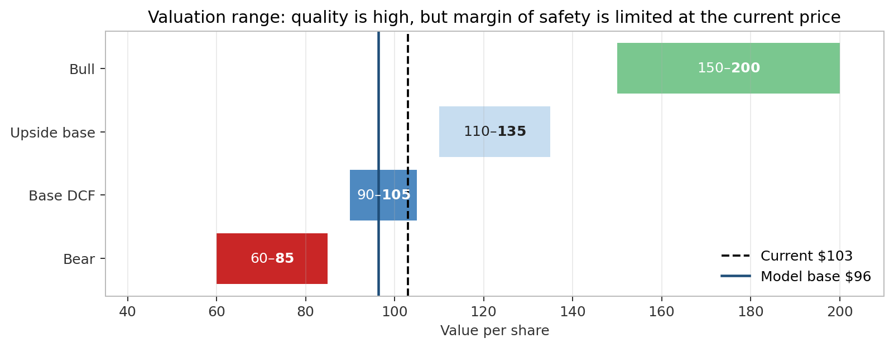
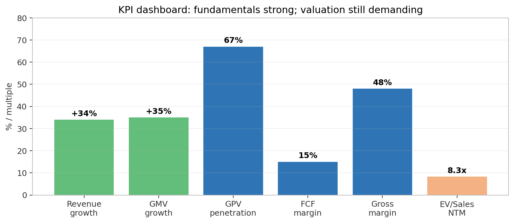
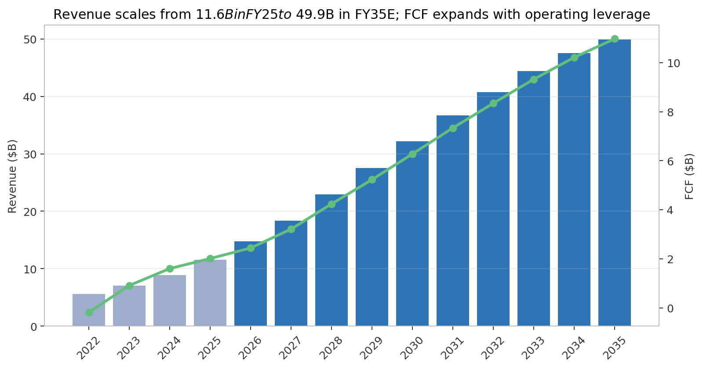
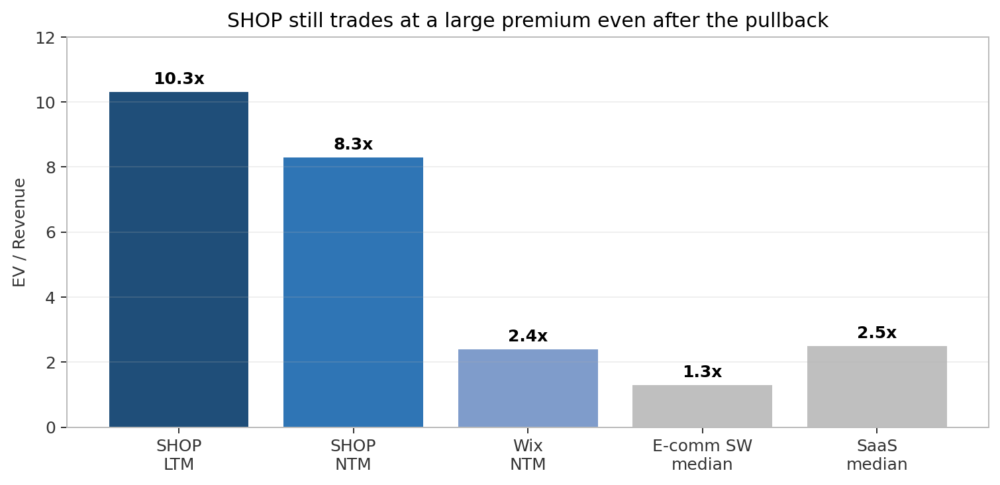
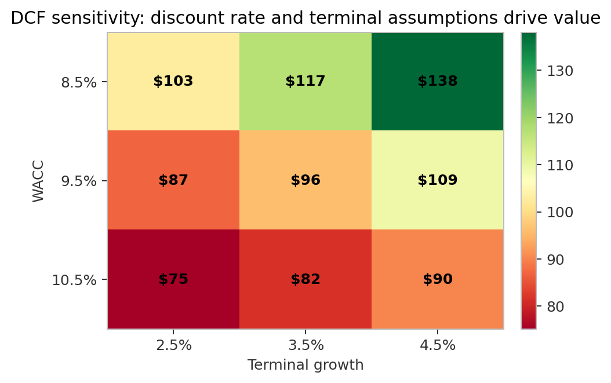

# Shopify Inc. (SHOP) — Initial Coverage Report

**Ticker:** SHOP US / SHOP CN  
**Company:** Shopify Inc.  
**Sector:** Software / Commerce Infrastructure  
**Date:** 2026-05-23  
**Analyst stance:** **Neutral / Accumulate on pullbacks**  
**Reference price:** **$103.00**  
**Market cap / EV:** **$134.0B / $127.7B**  
**Base intrinsic value:** **~$92/share DCF**, with broader framework-implied range of **$85–$150**  
**Street context:** Koyfin average target **$151.11**, high **$200**, low **$105**, 51 covering analysts

> **Interactive Research Artifacts:**
> - 📊 **Interactive Model View (Univer)**: [workbook.html](file:///Users/nelson/Documents/repos/fund/sectors/software/companies/SHOP/runs/2026-05-23-initial-coverage/workbook.html) (or [workboo_new.html](file:///Users/nelson/Documents/repos/fund/sectors/software/companies/SHOP/runs/2026-05-23-initial-coverage/workboo_new.html))
> - 🛝 **Interactive Presentation (HTML Slide Deck)**: [deck/index.html](file:///Users/nelson/Documents/repos/fund/sectors/software/companies/SHOP/runs/2026-05-23-initial-coverage/deck/index.html) (or [deck_new.html](file:///Users/nelson/Documents/repos/fund/sectors/software/companies/SHOP/runs/2026-05-23-initial-coverage/deck_new.html))
>
> **Source note:** This report uses the run-local Koyfin extraction in `data/raw/koyfin/` and the normalized source notes in `data/normalized/`. Key Koyfin tabs extracted: overview, description, actuals/consensus, estimates, price target, income statement, balance sheet, cash flow, multiples, EV, profitability, ROIC, ownership, earnings history, news, filings, transcripts, historical and performance.

---

## 1. Investment summary

Shopify is one of the highest-quality commerce infrastructure assets in public software: founder-led, asset-light, deeply embedded in merchant workflows, and now scaling from online-store software into a broader operating system for independent commerce. The company processed **$378B of GMV in FY2025** and crossed **$100.7B of GMV in Q1 2026**, while producing **$11.6B of FY2025 revenue**, **$2.0B of FY2025 free cash flow**, and **10 consecutive quarters of double-digit FCF margins**. It has a clean balance sheet, **$5.7B of cash and investments**, minimal debt, and a newly authorized **$2B repurchase program**.

The investment debate is not whether Shopify is a great company. It is whether a great company is cheap enough after the 2026 pullback. At **$103/share**, SHOP still trades at approximately **10.3x LTM EV/sales**, **8.3x NTM EV/sales**, **~44x NTM EV/EBITDA**, and **~55x NTM P/E**. Those multiples demand sustained revenue compounding above 20%, improving FCF margins, and a credible path to becoming the commerce infrastructure layer for AI/agentic shopping, B2B, international and offline commerce. Our base DCF, using consensus 2026–2028 revenue, decelerating growth, WACC near 9.5%, terminal growth of 3.5%, and terminal FCF margin of 22%, produces **~$92/share**, below the current price. A lower WACC / higher terminal growth setup or faster margin expansion supports values above $110–130, while a full bull case can support $150+.

Therefore, the initial stance is **Neutral / Accumulate on pullbacks** rather than outright Buy. The stock is high quality, the fundamental momentum remains strong, and consensus targets imply material upside, but the current valuation embeds little tolerance for a GMV or revenue slowdown, payment margin compression, or AI monetization disappointment. We would be more aggressive below **$90/share** or if the next two quarters demonstrate that high-20s revenue growth is the floor rather than the start of a longer deceleration.

### Key data points

| Metric | Latest / FY2025 | Comment |
|---|---:|---|
| Revenue | **$11.6B FY2025**, **$12.4B LTM** | FY2025 +30%, LTM +31.9% per Koyfin |
| GMV | **$378.4B FY2025**, **$100.7B Q1 2026** | Q1 GMV +35% YoY |
| Gross margin | **48.1% FY2025**, **48.0% LTM** | Mix shift to lower-margin Merchant Solutions |
| EBITDA margin | **16.7% FY2025**, **17.4% LTM** | Operating leverage emerging |
| FCF | **$2.0B FY2025**, **$2.1B LTM** | Asset-light; capex negligible |
| Balance sheet | **$5.7B cash/investments**, **$179M debt** | Net cash supports buyback / flexibility |
| Consensus revenue | **$14.8B FY2026**, **$18.3B FY2027**, **$22.9B FY2028** | Koyfin consensus |
| Current valuation | **10.3x LTM EV/sales**, **8.3x NTM EV/sales** | Premium multiple even after selloff |
| Analyst target | **$151 avg**, **$200 high**, **$105 low** | Koyfin price-target tab |

---

## 2. Business model and company overview

Shopify provides commerce infrastructure that helps merchants start, run, market, sell, fulfill, finance and analyze commerce across channels. The core product began as online-store software but has broadened into a merchant operating system: storefront, checkout, payments, point-of-sale, shipping, tax, capital, cross-border, B2B, demand generation, analytics, themes, apps, developer tools and increasingly AI-enabled workflows.

The model has two revenue streams.

**Subscription Solutions** is the high-gross-margin SaaS layer. Merchants pay monthly subscription fees for Standard plans, Shopify Plus, POS and related platform functionality. In Q1 2026, Subscription Solutions produced **$750M**, roughly **24% of revenue**, with gross margin around **80%**. Monthly recurring revenue was **$212M**, up **16.5% YoY**. Shopify Plus contributes roughly one-third of MRR and is important because it pulls Shopify upmarket into larger brands, B2B and more complex omnichannel use cases.

**Merchant Solutions** is the GMV-linked monetization layer. It includes Shopify Payments, Shop Pay, Shop Pay Installments, Shopify Capital, Shipping, Tax, Markets, POS hardware, partner fees and other services. In Q1 2026, Merchant Solutions produced **$2.42B**, roughly **76% of revenue**, up **39% YoY**. This segment is structurally lower margin — around high-30s gross margin — but it is strategically important because it monetizes merchant success. As merchants sell more, Shopify earns more. Payments penetration is central: Koyfin and company materials show Shopify Payments / GPV penetration at **67% of GMV in Q1 2026**, up materially over the last two years.

This dual model gives Shopify a better growth profile than a simple subscription business. The subscription layer creates merchant retention and platform control; Merchant Solutions creates take-rate expansion and higher revenue per merchant. The risk is that mix shift toward payments and capital can pressure gross margin and creates dependencies on payment rails, transaction loss management and regulatory compliance.

Shopify is headquartered in Ottawa, Canada, founded in 2004, and had approximately **7,600 employees**. It is founder-led by Tobias Lütke, who remains CEO, Chairman and Head of R&D. Insider ownership is meaningful: Koyfin shows insider holdings of **79.6M shares** and Tobias Lütke at approximately **79.1M shares**, about **6.1% of market cap**. That ownership aligns management with long-duration shareholders and supports the argument that Shopify will optimize for long-term merchant outcomes rather than near-term margin maximization.

---

## 3. Thesis

### Pillar 1 — Shopify is the operating system for independent commerce

Shopify is one of the few platforms that can credibly serve micro-merchants, scaling DTC brands, mid-market companies and a growing portion of enterprise commerce. It combines ease of use, a large app ecosystem, developer extensibility, payments, checkout, shipping and POS in one managed SaaS platform. Competitors often win in a single segment: WooCommerce for technical/self-hosted merchants, Wix and Squarespace for micro SMBs, BigCommerce for some mid-market/B2B buyers, Adobe and Salesforce for large enterprise, Square for offline SMB POS, and Amazon for marketplace demand. Shopify’s differentiation is breadth plus merchant alignment.

The most important moat is ecosystem density. More merchants attract more app developers, agencies and partners; more apps and partners make the platform more useful; more usefulness attracts more merchants. Switching costs increase as merchants integrate payments, checkout, inventory, shipping, themes, apps, analytics, financing and POS. There is no single contract lock-in, but operational lock-in can be high because migrations are risky during live commerce.

### Pillar 2 — Merchant Solutions deepens monetization as merchants grow

The company’s most powerful financial flywheel is not monthly subscription price. It is GMV growth multiplied by attach of payments, shipping, capital, tax, cross-border and advertising products. FY2025 revenue grew **30%** versus GMV growth of **29%**, and Merchant Solutions grew **35%** versus Subscription Solutions growth of **17%**. That pattern implies Shopify is capturing more economics from merchant success, not just adding new stores.

The risk is gross margin dilution. FY2025 gross margin declined to **48.1%** from **50.4%** in FY2024, reflecting the growing mix of Merchant Solutions. But the strategic trade is acceptable if Merchant Solutions strengthens retention, increases average revenue per merchant, and compounds FCF dollars. Shopify’s operating leverage can still improve even if gross margin is stable-to-down, provided sales & marketing, R&D and G&A decline as a percentage of revenue.

### Pillar 3 — Enterprise, B2B, international and POS extend the runway

Shopify’s core SMB/DTC market is large but no longer the only growth engine. The company is moving upmarket with Shopify Plus and Commerce Components, and has referenced wins with brands such as GM, Starbucks, Estée Lauder, L’Oréal, Kering Beauty, Amer Sports, Coach, Michael Kors and FanDuel. B2B GMV grew approximately **96% in FY2025** and **80%+ in recent quarters** from a smaller base. POS/offline revenue grew high-20s, and international revenue grew mid-30s. These expansion vectors matter because they reduce reliance on North American online SMB formation.

The upmarket opportunity is real but not risk-free. Adobe Commerce, Salesforce Commerce Cloud, SAP Commerce Cloud, commercetools and custom/proprietary platforms remain entrenched in the largest and most complex enterprises. Shopify can win by being simpler, cheaper and faster, but it must prove it can handle deep enterprise customization, global compliance, large catalogs, multi-brand/multi-region complexity and enterprise sales motion.

### Pillar 4 — AI and agentic commerce are an option, not yet base-case value

Shopify is positioning itself as the commerce infrastructure layer for agentic commerce. The company has announced or discussed Sidekick, agentic storefronts, Shopify Catalog, Universal Commerce Protocol with Google, and distribution into AI surfaces such as ChatGPT, Microsoft Copilot and Google AI Mode. Early metrics sound impressive: AI-referred orders up many-fold from a small base, AI-referred shoppers converting better than general AI search, and Sidekick usage expanding.

We treat AI as a strategic option rather than core DCF value today. If AI shopping agents need structured product data, reliable checkout, merchant permissions, payments, identity, post-purchase and returns, Shopify is well-positioned to provide that layer. If AI agents disintermediate storefronts and route demand to platforms that bypass Shopify economics, the risk is material. The correct monitoring approach is to track AI-driven GMV, conversion, monetization and whether Shopify captures payment/checkout economics in agentic flows.

---

## 4. Financial analysis

Shopify has reaccelerated growth while reaching material profitability. FY2025 revenue was **$11.56B**, up **30%**, with **$5.56B** of gross profit and **$2.01B** of free cash flow. Q1 2026 revenue was **$3.17B**, up **34%**, with **$476M** of FCF and **15%** FCF margin. Koyfin shows LTM revenue of **$12.37B**, LTM EBITDA of **$2.15B**, LTM EBIT of **$2.12B**, and LTM FCF of **$2.1B**.

Revenue mix is shifting toward Merchant Solutions. Merchant Solutions was about **73%** of FY2022 revenue and **76%** of FY2025 revenue. This mix shift is logical because merchant GMV and payment penetration are scaling faster than subscription MRR. The financial implication is lower gross margin but more absolute gross profit dollars and greater merchant embeddedness. Subscription gross margin remains around **80%**; Merchant Solutions gross margin around **38–39%**.

Operating leverage is the key positive. FY2022 and FY2023 were burdened by heavy investment and logistics-related complexity, but Shopify has since exited logistics and refocused on asset-light software and services. Operating income improved from losses in FY2022/FY2023 to **$1.1B in FY2024** and **$1.5B in FY2025**. Koyfin shows LTM EBIT margin of **17.1%**, though reported quarterly numbers can move due to investment marks and cost timing. Free cash flow margins have remained in the mid-to-high teens, with management guiding Q2 2026 to mid-teens FCF margin.

The balance sheet is an advantage. Shopify has **$5.7B** of cash and short-term investments and only **$179M** of total debt per Koyfin. That liquidity supports product investment, M&A optionality, merchant capital growth and share repurchases. The $2B buyback is also useful because SBC is around **4% of revenue** and should be treated as an economic cost. Repurchases can offset dilution, but buying back stock at high multiples only creates value if intrinsic value is materially above repurchase price.

### Historical financial summary

| $M except margin | FY2022 | FY2023 | FY2024 | FY2025 | LTM / Current |
|---|---:|---:|---:|---:|---:|
| Revenue | 5,600 | 7,060 | 8,880 | 11,556 | 12,370 |
| Revenue growth | 21% | 26% | 26% | 30% | 31.9% |
| Gross margin | 49.2% | 49.8% | 50.4% | 48.1% | 48.0% |
| Operating income | (822) | (1,418) | 1,075 | 1,468 | 2,120 |
| Operating margin | (14.7%) | (20.1%) | 12.1% | 12.7% | 17.1% |
| Free cash flow | (186) | 905 | 1,597 | 2,007 | 2,100 |
| FCF margin | (3.3%) | 12.8% | 18.0% | 17.4% | 17.0% |

### Consensus setup

Koyfin consensus is constructive: **$14.8B FY2026 revenue**, **$18.3B FY2027 revenue**, and **$22.9B FY2028 revenue**, implying growth of **28%**, **24%**, and **25%**. Consensus EBITDA expands from **$2.74B FY2026** to **$4.89B FY2028**. This is a demanding but plausible path if GMV remains healthy, payments penetration continues increasing, and B2B/international/enterprise contribute.

The near-term risk is deceleration optics. Q1 2026 grew **34%**, but Q2 guidance calls for high-20s revenue growth, mid-20s gross profit growth, opex at **35–36%** of revenue, and mid-teens FCF margin. The stock’s post-earnings reaction indicates investors are highly sensitive to the slope of deceleration and to the gap between revenue growth and gross profit growth.

---

## 5. Management and governance

Shopify remains founder-led, which is a meaningful part of the investment case. Tobias Lütke is not only CEO and Chairman but also Head of R&D, an unusual combination that reinforces Shopify’s product-led culture. His background as a developer and original founder matters because Shopify’s differentiation is not primarily financial engineering; it is product velocity, merchant empathy, and a willingness to make long-cycle platform bets before they are fully monetizable. The company’s current AI and agentic commerce push fits that pattern: rather than waiting for AI platforms to define commerce standards, Shopify is trying to make its catalog, checkout and protocol layer part of the emerging infrastructure.

President Harley Finkelstein is the company’s external commercial voice and has become central to the merchant narrative. He frames Shopify as aligned with merchant success — “as merchants do better, Shopify does better” — which captures the core business model. CFO Jeff Hoffmeister brings capital markets and financial discipline. The post-logistics Shopify has shown a more balanced model: still investing aggressively, but with sustained FCF generation, opex discipline, a net-cash balance sheet and a $2B buyback authorization. COO Jessica Hertz, appointed after serving in senior legal / operating roles, adds continuity in execution and governance.

Governance considerations are mixed but broadly acceptable for a founder-led compounder. Insider ownership is a positive; Koyfin shows Tobias Lütke owning roughly 6.1% of market cap. That is large enough to matter and creates alignment with long-term value creation. The offset is that founder-led companies can underweight near-term shareholder pressure, especially when investing into uncertain categories such as AI. For Shopify, that trade-off is acceptable if product velocity remains high and capital allocation stays disciplined. The key governance watch item is whether the company can balance long-duration AI investment with FCF margin durability and transparent disclosure.

Culture is also an asset. Shopify’s public materials emphasize long-term thinking, remote-first work, product velocity, and merchant obsession. The company claims hundreds of product updates across recent Editions cycles, and the breadth of updates — AI tools, B2B, Markets, POS, checkout, Shop Pay, apps, developer infrastructure — shows a platform that is still compounding functionality. In software platforms, product velocity itself can be a moat because merchants and developers see continuous improvement without having to migrate or rebuild.

---

## 6. Competitive landscape

Shopify competes across several markets rather than one clean category. In storefront software it competes with WooCommerce, BigCommerce, Wix, Squarespace, Adobe Commerce, Salesforce Commerce Cloud and custom builds. In payments it competes economically with Stripe, PayPal, Adyen, Block/Square and other processors. In POS it competes with Square, Lightspeed, Toast and legacy retail systems. In demand capture it competes indirectly with Amazon, Google, Meta, TikTok and marketplaces.

The strongest competitive advantage is merchant alignment. Amazon owns the customer relationship and can compete with merchants. Shopify enables merchant independence: control of brand, customer data, checkout, pricing and storefront. That value proposition is central to DTC and brand-led commerce.

The second advantage is ecosystem breadth. WooCommerce has broad plugin availability but is self-hosted and operationally complex. Wix/Squarespace are easier for micro merchants but less robust for scaling commerce. BigCommerce is credible in mid-market and B2B, especially where merchants dislike transaction fees. Adobe and Salesforce are powerful in enterprise but can be expensive, complex and slower to implement. Shopify’s wedge is a managed platform with enough flexibility to serve larger merchants while preserving speed and simplicity.

The main vulnerability is the highest-end enterprise and AI-driven channel shift. At $200M+ and $1B+ GMV merchants, custom systems, Adobe, Salesforce, SAP and composable/MACH architectures remain relevant. In AI shopping, if discovery and checkout happen inside AI agents and large platforms own demand, Shopify must ensure its infrastructure remains in the transaction path.

---

## 7. Valuation

At $103/share, SHOP is not optically cheap. Koyfin current multiples show **EV/sales LTM 10.3x**, **EV/sales NTM 8.3x**, **EV/EBITDA NTM 44.4x**, **P/E NTM 54.5x**, and **P/FCF LTM above 60x**. The company deserves a premium to small e-commerce software comps because it is larger, faster growing, more profitable, and has stronger network effects. But the premium is still large.

Our DCF framework begins with consensus revenue through FY2028 and then fades growth from ~20% to mid-single digits by FY2035. FCF margin expands from the mid-teens to **22% terminal**, reflecting operating leverage, partially offset by Merchant Solutions gross margin pressure and ongoing AI/international investment. WACC is **9.5%** in base case; terminal growth **3.5%**. This produces enterprise value around **$114B**, equity value around **$120B**, and value per share around **$92** after adding net cash.

Sensitivity is high. With WACC at **8.5%** and terminal growth at **3.5%**, value rises to about **$112/share**. With WACC at **8.5%** and terminal growth **4.5%**, value is around **$133/share**. A more aggressive bull case using higher long-term revenue, faster FCF margin expansion and a lower discount rate can justify **$150+**. Conversely, if WACC is **10.5%** and terminal growth **2.5–3.5%**, value falls into the **$70–80/share** range.

The valuation conclusion is balanced: the stock is no longer priced for perfection after the drawdown, but it still requires execution excellence. We would use **$85–$150** as the practical valuation range, with **~$120** as an upside-biased blended framework value if one gives partial credit to AI/agentic commerce and premium public comps. The base DCF alone is closer to **$92**, so the stock needs either a lower cost of capital, higher terminal growth, or better long-run margins to be clearly undervalued.

---

## 8. Catalysts

1. **Q2 2026 earnings (expected early August 2026):** Most important near-term event. Investors need evidence that high-20s growth guidance is conservative and that FCF margin remains durable.
2. **GMV and payments penetration:** Sustained GMV growth above revenue deceleration fears and GPV penetration moving beyond 67% would support Merchant Solutions upside.
3. **AI/agentic commerce milestones:** Quantified AI-referred GMV, conversion, take rate and merchant ROI could convert a narrative option into modelable revenue.
4. **B2B / enterprise wins:** Additional large brands and B2B GMV disclosure would validate the upmarket thesis.
5. **International and POS expansion:** Continued high growth outside North America and in offline commerce broadens TAM.
6. **Buyback execution:** Repurchases below intrinsic value can offset dilution and signal management confidence.
7. **Legal/regulatory updates:** Sezzle antitrust and AI governance headlines can swing sentiment.

---

## 9. Risks

**Valuation risk:** Shopify’s premium multiple leaves little room for disappointment. Even after the selloff, the stock trades well above most e-commerce software peers and requires long-duration growth.

**Growth deceleration:** Q2 guidance implies slower revenue growth than Q1. If deceleration persists into 2027, the DCF and multiple framework compress quickly.

**Gross margin mix pressure:** Merchant Solutions is lower gross margin than Subscription Solutions. Payments, capital and transaction/loan losses can pressure blended gross margin.

**Competition:** Shopify faces pressure from WooCommerce, BigCommerce, Wix/Squarespace, Adobe, Salesforce, Amazon, Square/Block, Stripe, PayPal and Adyen across its value chain.

**AI disintermediation:** AI agents could either expand Shopify’s reach or reduce storefront relevance. The outcome is uncertain.

**Payments dependency and regulation:** Shopify Payments relies on payment infrastructure and operates in regulated financial flows. Changes to payment economics, BNPL rules, antitrust scrutiny or international compliance could affect economics.

**Macro and consumer spending:** Shopify is GMV-linked. Consumer weakness, tariffs, cross-border friction and merchant failures would hit revenue and credit/loan losses.

**SBC and dilution:** SBC is around 4% of revenue. Buybacks offset some dilution but do not eliminate the economic cost.

**Equity investment volatility:** GAAP earnings are distorted by mark-to-market movements in equity investments such as Klaviyo, Affirm and Global-e. This does not change core FCF but can affect headline EPS and sentiment.

---

## 10. What would change the view

**Upgrade to Buy / more constructive:** evidence of sustained revenue growth above 25%, FCF margin moving toward 18–20% without starving product investment, payments penetration moving toward 75%, quantified AI/agentic GMV contribution, enterprise/B2B wins accelerating, or share price below $90 without thesis deterioration.

**Downgrade / avoid:** revenue growth falling below low-20s, GMV growth materially slowing, gross margin breaking below mid-40s, opex staying >36% of revenue without payoff, AI channels bypassing Shopify checkout/payment economics, or regulatory action reducing payments/BNPL monetization.

---

## 11. Conclusion

Shopify is a scarce asset: scaled, founder-led, profitable, growing around 30%, and positioned at the intersection of software, payments, commerce, AI and merchant entrepreneurship. The business quality is high and the long-term runway remains credible across payments, B2B, enterprise, international, POS and AI-enabled commerce.

The investment issue is valuation discipline. At $103/share, the stock is below street targets and materially off its highs, but our base DCF does not provide a large margin of safety. The right posture is to own the work, track the KPIs closely, and be ready to add on either price weakness or proof that growth and margins can exceed the base case. For now: **Neutral / Accumulate on pullbacks**.
